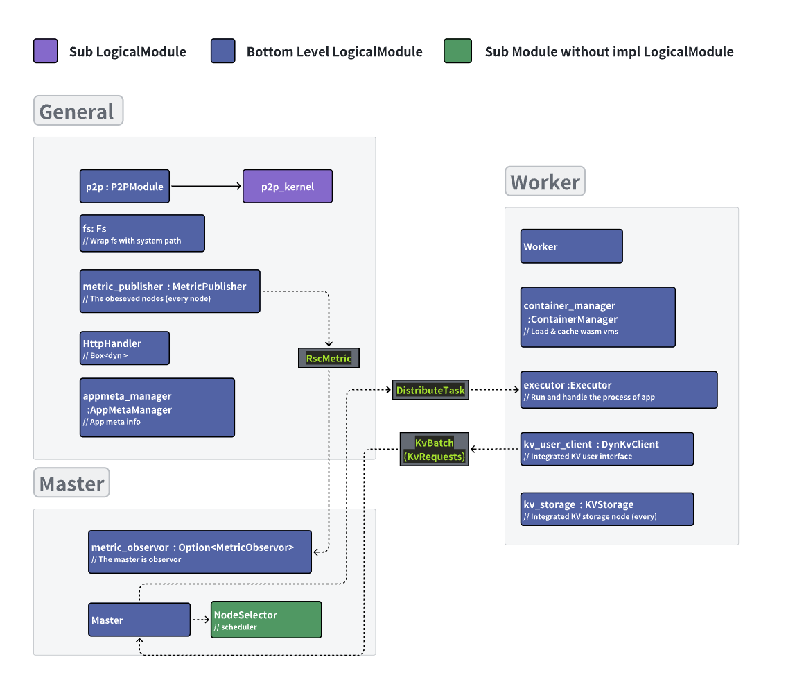
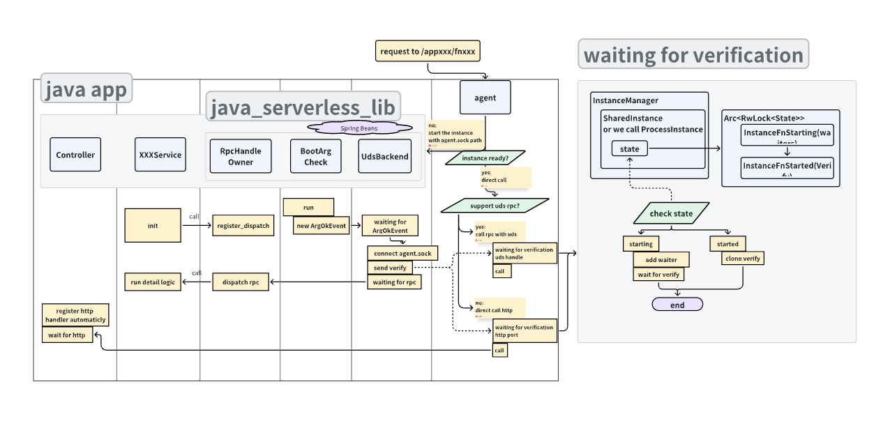
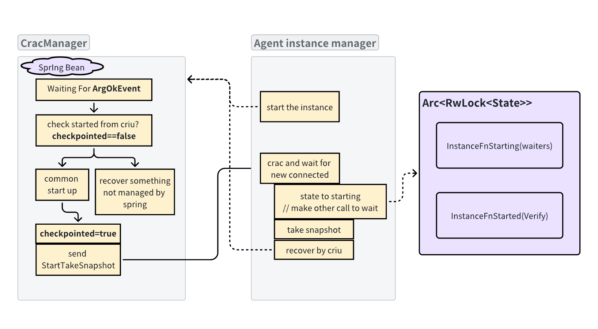
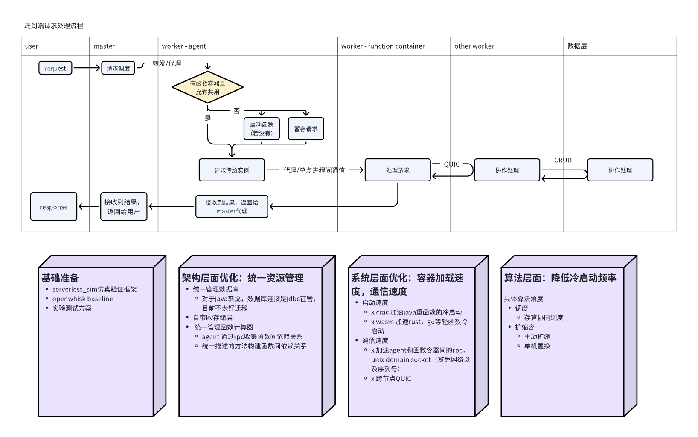

block docx-image-block:

A serverless distributed system with WASM, DataEventDrivenGraph, Integrated Storage

# Related Links

Github:[https://github.com/340lab/waverless](https://github.com/340lab/waverless)

Lark:[https://fvd360f8oos.feishu.cn/docx/XSxcdONk2oVJD5xtZuicxftqn3f](https://fvd360f8oos.feishu.cn/docx/XSxcdONk2oVJD5xtZuicxftqn3f)

# Develop standard

[项目迭代规范](https://fvd360f8oos.feishu.cn/wiki/PwQQwjt3liLWcXkoO1McqQrEnHb)

# Get started

Make sure you‘re using alinuxsystem to run this project, it can be in vm or docker. (Current scripts are using apt to install things, so you'd better be with debian).

Git clone this project[https://github.com/340Lab/waverless](https://github.com/340Lab/waverless)

Run commands

Check the results

# Environment Prelimit

block docx-bullet-block:•
Support linux only (Reason: WASI Runtime, support rust async scheduling)

block docx-bullet-block:•
WasmEdge:
https://wasmedge.org/docs/embed/rust/intro#usage

# Features

block docx-bullet-block:•
Better low level performance: rust, tokio async scheduling, WASM & CRIU for function, QUIC & protobuf & UDS for communication

block docx-bullet-block:•
(In progress) Function characterization & relation aware scaling & scheduling

block docx-bullet-block:•
(In progress) Embed KV Storage, Storage-Compute Collaborative Scheduling

# Design

## Modules and RPC Design



## Different Instance(app) Types

block docx-table-block:SharedInstance
OwnedInstance
feature
Fat instance run in process or container, such as java
Light instance which binded on thread and one instance can only handle one request
technology
CRIU(CRaC), UDS
WASM, Cache

## Agent Trigger App by HTTP or UDS



## CRIU for Java (SharedInstance)



## KV Trigger Function


## Management UI

block docx-image-block:

## Cluster Config Format

```
nodes:
1:
addr: 127.0.0.1:2500
domain: # optional
spec: [meta,master]
2:
addr: 127.0.0.1:2505
domain: # optional
spec: [meta,worker]
loki:
addr: # optional, for cluster deployment
```

## Project Config Format

block docx-bullet-block:•
v2
One project may contains multiple apps, which contains multiple functions.
The app is the cold start unit.
stock-mng:
  query:         
    http.post:
      call: direct   # The function has the http handler
  StockMngFacade.queryProductPrice:
    rpc:
  ...
  balance-mng:
  BalanceMngFacade.createUser:
    rpc:
  ...
  word_count:
  split_file:
    http.get:
      call: indirect    # The function can only be called by agent
    kvs:
      wordcount_slice_{}: [set]
  handle_one_slice:
    # 函数输入参数为触发事件关联数据，比如http就是json（未适配），kv就是key
    condition:
      kv_set: 0
    kvs: 
      wordcount_slice_{}: [delete]
      wordcount_{}: [set]

block docx-bullet-block:•
v1

# Roadmap



block docx-bullet-block:•
Basic stuffs
跨线程共享的全局数据结构
p2p（quic+protobuf）
rpc

block docx-bullet-block:•
Metric, collecting infos of each nodes
basic
Support prometheus
◦
Collect different metric types and adapt to prometheus
▪
Each function
•
Request complete time (Histogram)
•
Request count
•
Cold start time

block docx-bullet-block:•
Basic scheduler single master - multiple worker
Docking wasmedge, add cache for each function.
飞书用户6188

block docx-bullet-block:•
Basic Integrated KV storage Waverless kv design
Wasm host function, Kv event
飞书用户6188
Batch operation and basic lock on master
飞书用户6188

block docx-bullet-block:•
Complex Stuffs / Optimizations
◦
KV event scheduling
Recover the kv event feature （pr/33，kv设计见总设计文档的图KV RPC）
飞书用户6188
◦
Scheduling algorithm
random
飞书用户6188
hash
飞书用户6188
straw2 @自然选择

block docx-bullet-block:•
Cluster deployment with docker and ansible
basic
飞书用户6188

block docx-bullet-block:•
Comprehensive tests are necessary for writing paper.
Goose stress test
飞书用户6188
Network bandwidth and latency limit with tc
飞书用户6188
Different load apps v1（pr/33，test设计）
飞书用户6188
Git action integrity testing (pr/35)
飞书用户6188

block docx-bullet-block:•
Document
scripts

block docx-bullet-block:•
Real scene
panote blog (https://github.com/340Lab/waverless/commit/fa8491bcd40462162593f7643c0d26ae2e131f0e)
飞书用户6188

# Experiments

分析其他论文的测试

block docx-table-block:指标
负载
延迟
百分比延迟（尾延迟）
吞吐量
成本
性价比
helloworld
Word count

## Different load apps v1

block docx-bullet-block:•
【done】fn2: (Refer to ServerlessBench
hello world，pure compute, test cold start

block docx-bullet-block:•
【done】word_count: （Refer to paper astra
kv event

block docx-bullet-block:•
【done】longchain: （Refer to ServerlessBench
固定100长度，每个函数对数据做一定的操作，并输出给下一个

## Design App classification from tracing

block docx-bullet-block:•
Function run time short/long function , 50 ms

## Steps

block docx-bullet-block:•
Deploy cluster (scripts/deploy_cluster)

block docx-bullet-block:•
Test perf

