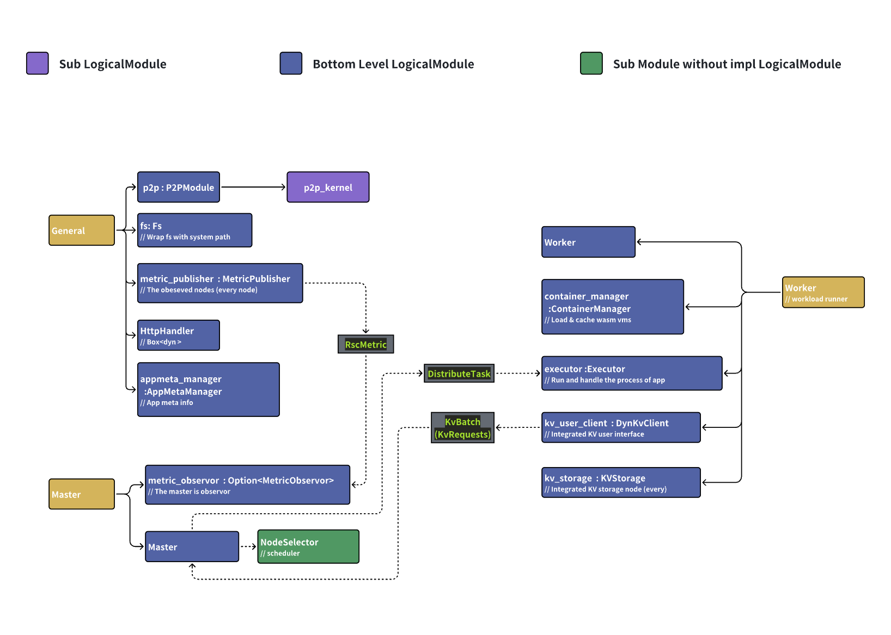
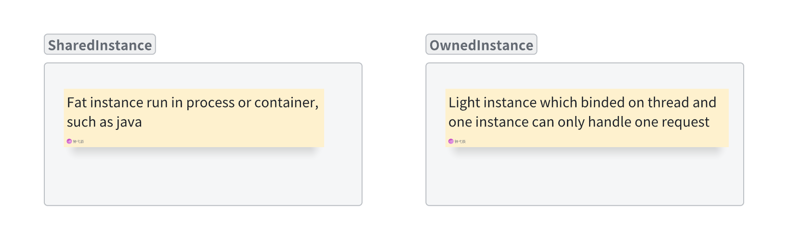
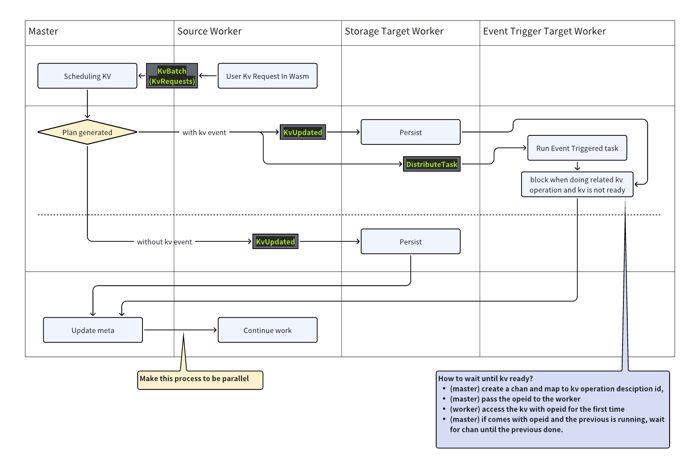
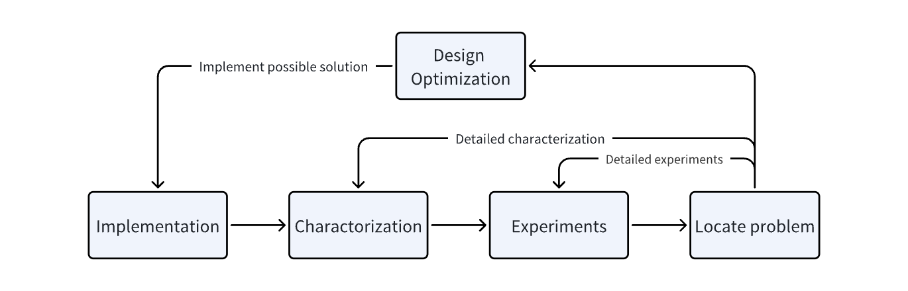

block docx-image-block:

A serverless distributed system with WASM, DataEventDrivenGraph, Integrated Storage

# Related Links

Lark:[https://fvd360f8oos.feishu.cn/docx/XSxcdONk2oVJD5xtZuicxftqn3f](https://fvd360f8oos.feishu.cn/docx/XSxcdONk2oVJD5xtZuicxftqn3f)

Github:[https://github.com/340lab/waverless](https://github.com/340lab/waverless)

# Develop standard

[项目迭代规范](https://fvd360f8oos.feishu.cn/wiki/PwQQwjt3liLWcXkoO1McqQrEnHb)

# Get started

Make sure you‘re using a linux system to run this project, it can be in vm or docker.

Git clone this project

Run commands

   ``` bash
   # Install python and ansible
   # Issue: Error when installing ansible: https://zhuanlan.zhihu.com/p/361790784
   bash scripts/install/1.install_basic.sh
   # Install environment
   bash scripts/install/2.ans_install_build.sh
   # Compile project and it's test apps
   bash scripts/deploy_single_node/1.ans_build.sh
   # Start demo nodes
   python3 scripts/deploy_single_node/pack/run_node.py 1
   python3 scripts/deploy_single_node/pack/run_node.py 2
   # Test the api
   # Make sure the GATEWAY='http://127.0.0.1:2501' in scripts/test_http.py
   python3 scripts/http_test.py
   ```
   
  
Check the results

   block docx-image-block:
   
  
# Environment Prelimit

block docx-bullet-block:•
Support linux only (Reason: WASI Runtime, support rust async scheduling)

block docx-bullet-block:•
Tested rust version: 1.76.0

block docx-bullet-block:•
WasmEdge:
https://wasmedge.org/docs/embed/rust/intro#usage

# Features

block docx-bullet-block:•
Better low level performance: rust, tokio async scheduling, WASM lightweight function, QUIC & protobuf network

block docx-bullet-block:•
Detailed app characterization: with data and other dynamic infos

block docx-bullet-block:•
Data and computing coordination

# Design

block docx-bullet-block:•
Comprehensive experiments

## Modules and RPC Design



## Different App Types



## KV Trigger Function



## Management UI

block docx-image-block:

## Cluster Config Format

``` yaml
nodes:
  1:
    addr: 127.0.0.1:2500
    domain: # optional
    spec: [meta,master]
  2:
    addr: 127.0.0.1:2505
    domain: # optional
    spec: [meta,worker]
```

## Project Config Format


v2: One project may contains multiple apps, which contains multiple functions.
The app is the cold start unit.

``` yaml
stock-mng:
  query:         
    http.post:
      call: direct   # The function has the http handler
  StockMngFacade.queryProductPrice:
    rpc:
  ...
  balance-mng:
  BalanceMngFacade.createUser:
    rpc:
  ...
  word_count:
  split_file:
    http.get:
      call: indirect    # The function can only be called by agent
    kvs:
      wordcount_slice_{}: [set]
  handle_one_slice:
    # 函数输入参数为触发事件关联数据，比如http就是json（未适配），kv就是key
    condition:
      kv_set: 0
    kvs: 
      wordcount_slice_{}: [delete]
      wordcount_{}: [set]
```

# Roadmap

block docx-bullet-block:•
v1



block docx-bullet-block:•
Basic stuffs
跨线程共享的全局数据结构
p2p（quic+protobuf）
rpc

block docx-bullet-block:•
Metric, collecting infos of each nodes
basic
Support prometheus
◦
Collect different metric types and adapt to prometheus
▪
Each function
•
Request complete time (Histogram)
•
Request count
•
Cold start time
•
Instance count
•
Resource usage

block docx-bullet-block:•
Basic scheduler single master - multiple worker
Docking wasmedge, add cache for each function.
飞书用户6188
Schedule for request
飞书用户6188
App metadata waverless 应用元数据
飞书用户6188
Configurable domain (pr/32)
飞书用户6188

block docx-bullet-block:•
Basic Integrated KV storage Waverless kv design
Wasm host function, Kv event
飞书用户6188
Batch operation and basic lock on master
飞书用户6188
KV router and persistence on master
飞书用户6188

block docx-bullet-block:•
Complex Stuffs / Optimizations
◦
KV event scheduling
Recover the kv event feature （pr/33，kv设计见总设计文档的图KV RPC）
飞书用户6188

block docx-bullet-block:•
Cluster deployment with docker and ansible
basic
飞书用户6188

block docx-bullet-block:•
Comprehensive tests are necessary for writing paper.
Goose stress test
飞书用户6188
Network bandwidth and latency limit with tc
飞书用户6188
Different load apps v1（pr/33，test设计）
飞书用户6188
Git action integrity testing (pr/35)
飞书用户6188
Update cluster deployment (pr/38)
飞书用户6188
匿名模式下无法访问

block docx-bullet-block:•
Document
scripts

block docx-bullet-block:•
Real scene
panote blog (https://github.com/340Lab/waverless/commit/fa8491bcd40462162593f7643c0d26ae2e131f0e)
飞书用户6188

# Experiments

分析其他论文的测试

block docx-table-block:指标
负载
延迟
百分比延迟（尾延迟）
吞吐量
成本
性价比
helloworld
Word count

## Different load apps v1

block docx-bullet-block:•
【done】fn2: (Refer to ServerlessBench
hello world，pure compute, test cold start

block docx-bullet-block:•
【done】word_count: （Refer to paper astra
kv event

block docx-bullet-block:•
【done】longchain: （Refer to ServerlessBench
固定100长度，每个函数对数据做一定的操作，并输出给下一个

## Design App classification from tracing

block docx-bullet-block:•
Function run time short/long function , 50 ms

## Steps

block docx-bullet-block:•
Deploy cluster (scripts/deploy_cluster)

block docx-bullet-block:•
Test perf


# Scripts

block docx-quote_container-block:Scripts with single-digit indexes, such as 1.xxxx, are intended for public use, with the number representing to some extent the order of usage.

block docx-bullet-block:•
Install
◦
1.install_basic.sh (install python and ansible, to enable the following operations)
◦
2.ans_install_build.sh (install build needed)
◦
3.install_docker.sh (docker is not necessary)

block docx-bullet-block:•
build
◦
1._ans_build_sys_with_apps.yml

block docx-bullet-block:•
deploy_cluster
◦
1.ansible_setup.py (setup ansible and ssh inter-communication)
◦
2.ans_redeploy_cluster.sh (deploy to cluster following th e node_config.yaml)

block docx-bullet-block:•
deploy_monitor
◦
start.py (deploy monitor related (loki(log storage), prometheus(metric storage), grafana(visualization)))
◦
reload_prometheus.py (reload when change the prometheus.yml)

block docx-bullet-block:•
deploy_single_node
◦
1.ans_build.sh (call the install, build and copy node_config.yaml)

block docx-bullet-block:•
docker
◦
WasmEdge (the basic system and environment)
◦
Waverless (bind entrypoint)


